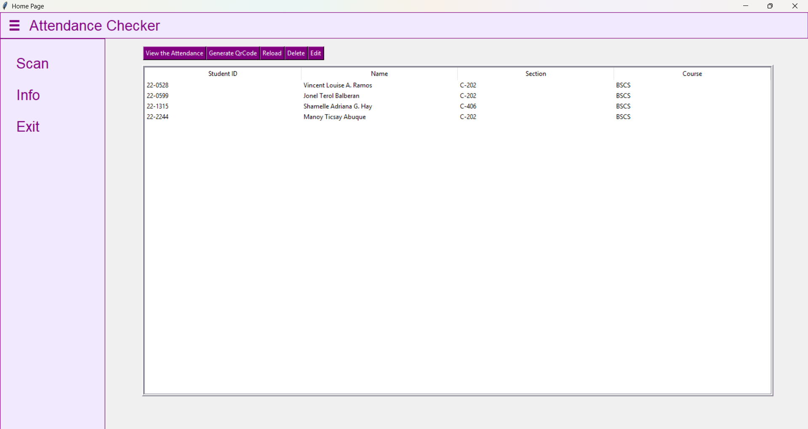
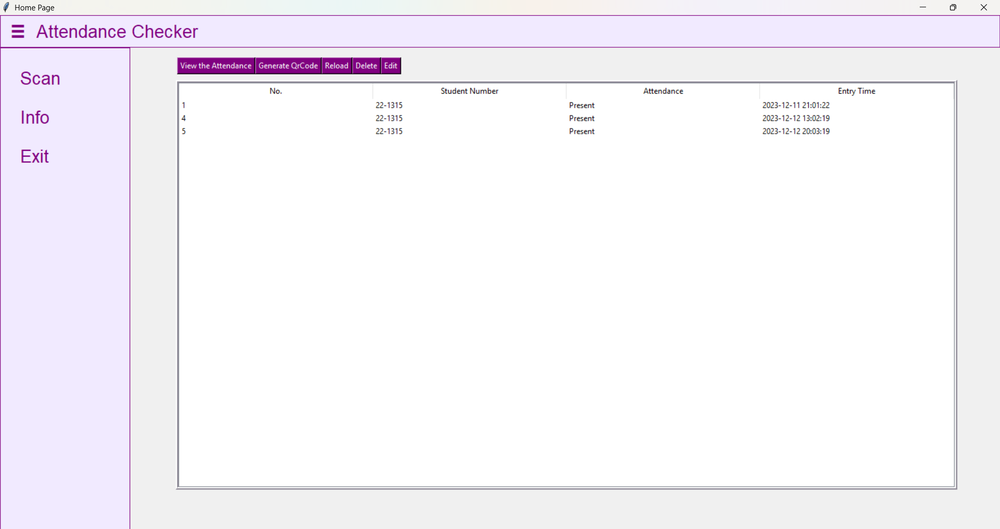
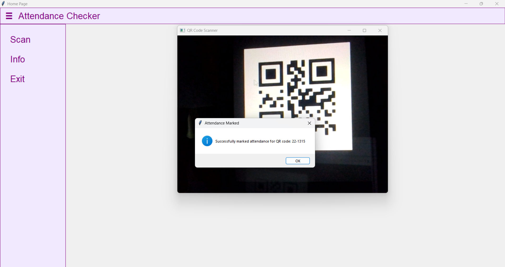
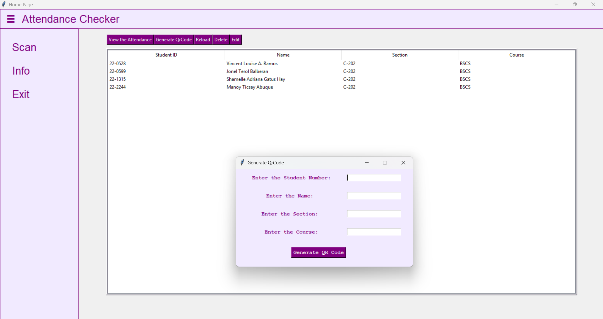
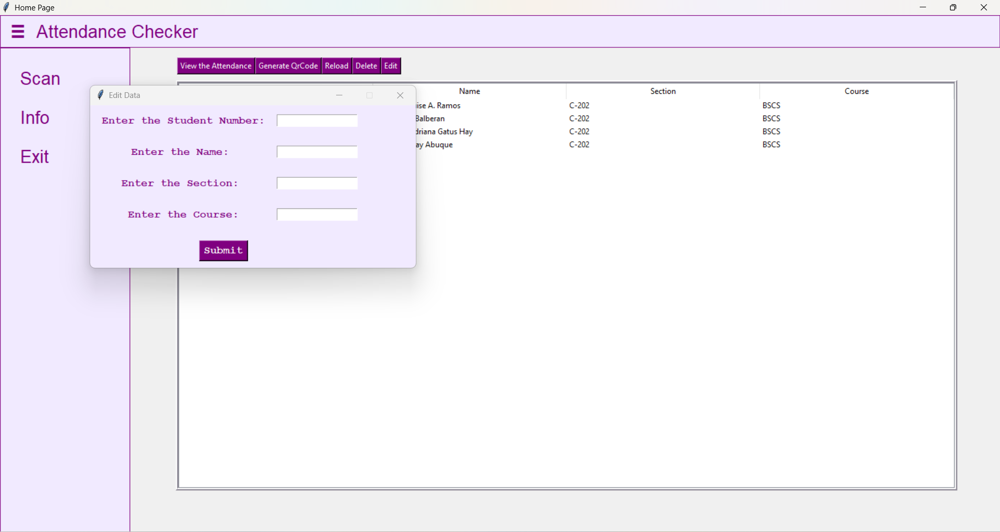
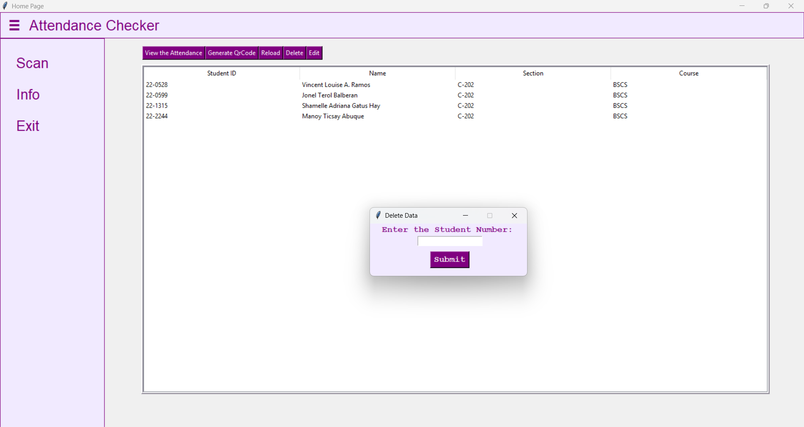

## Description
  The QR Code Attendance Checker System is a simple application designed to record attendance efficiently using QR codes. Instead of manual sign-in, users scan a QR code to mark their attendance quickly and accurately.
  
  This system is intended for educational purposes and serves as a basic implementation of QR code–based attendance tracking.

## Features
  - QR code scanning for attendance
  - Automatic attendance time recording
  - Simple and easy-to-use interface
  - Organized attendance records

## Technologies
 - Python
 - Tkinter
 - MySQL (XAMPP)
 - OpenCV
 - pyzbar
 - PyCharm
   
## Screenshots

### Login Screen
Allows the administrator to securely log in to the system before accessing attendance management features.

### Home 
Displays the main dashboard where users can navigate to different system functions.
Shows basic system information and available actions for the user.

### View Attendace
Allows the administrator to see the attendance of a student by entering the student number.
It displays the list of recorded attendance entries stored in the database.

### Scan QR Code
Enables the user to scan a QR code to record attendance automatically.

### Generate QR Code
Allows the administrator to input the student number, name, section, and course to generate a unique QR code for student attendance.

### Edit Record
Allows the administrator to edit the student’s name, section, and course by entering the student number.

### Delete Record
Allows the administrator to remove a student information from the system.

